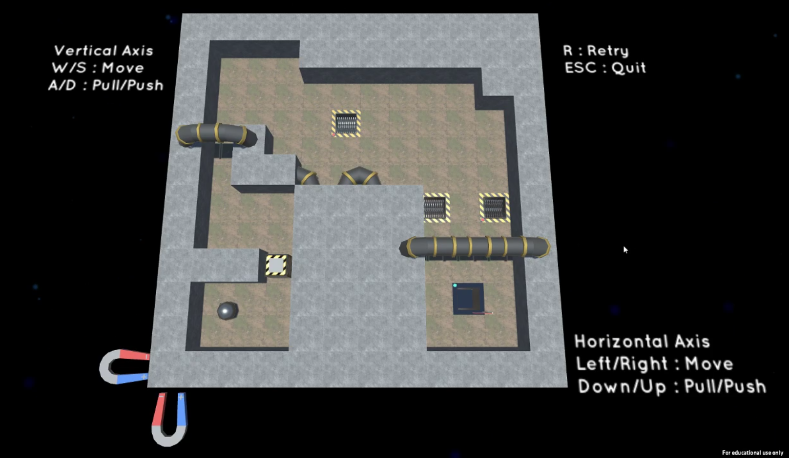
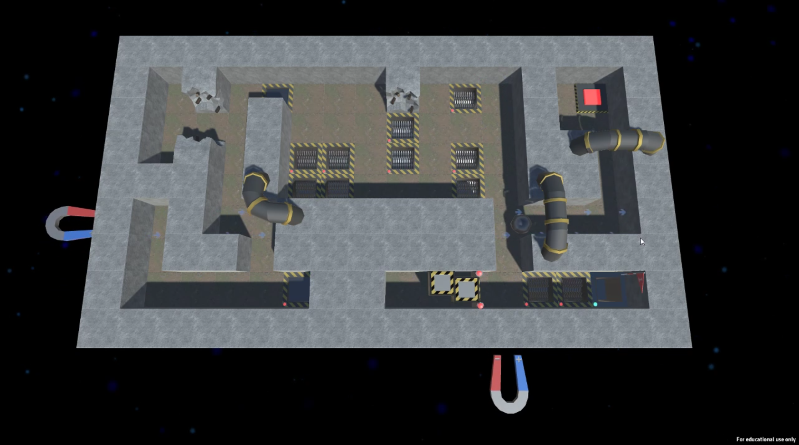

# Magnetic Jolf (Game Jam) (July 2019)
Magnetic Jolf is a Game Jam game created by myself and other AIE students.

The Game Jam was held at AIE Campus Canberra on July 2019. The theme of the jam was **It's not you. It's me.** 
Our group consisted of five members: one artist, two designers and myself as the programmer. We were given one weekend to create a game that somewhat related to the theme.

We chose to create a game that revolved around using magnets to move a ball around a maze. We thought magnets loosely related to the theme because they can repel and attract. The game was created in **C# Unity** and we finished it with multiple functioning levels, a main menu and a credits screen.

This was my very first Game Jam experience. I am proud of what we, as a team, accomplished and it definitely helped me improve as a programmer and a teammate.

**Magnetic Jolf Gameplay Video - [LINK](https://youtu.be/9bJsTtejxps)** 
 
**Screenshots** 

 

## Credits & Acknowledgements
### Design
- Matthew Eccles
- Christopher Selleck
### Art
- Alexander Murphy
### Programming
- David Flintoft

    
 
Academy of Interactive Entertainment Canberra 
